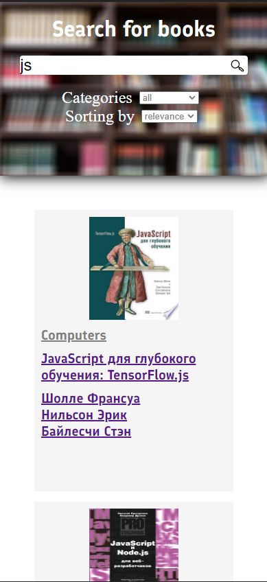
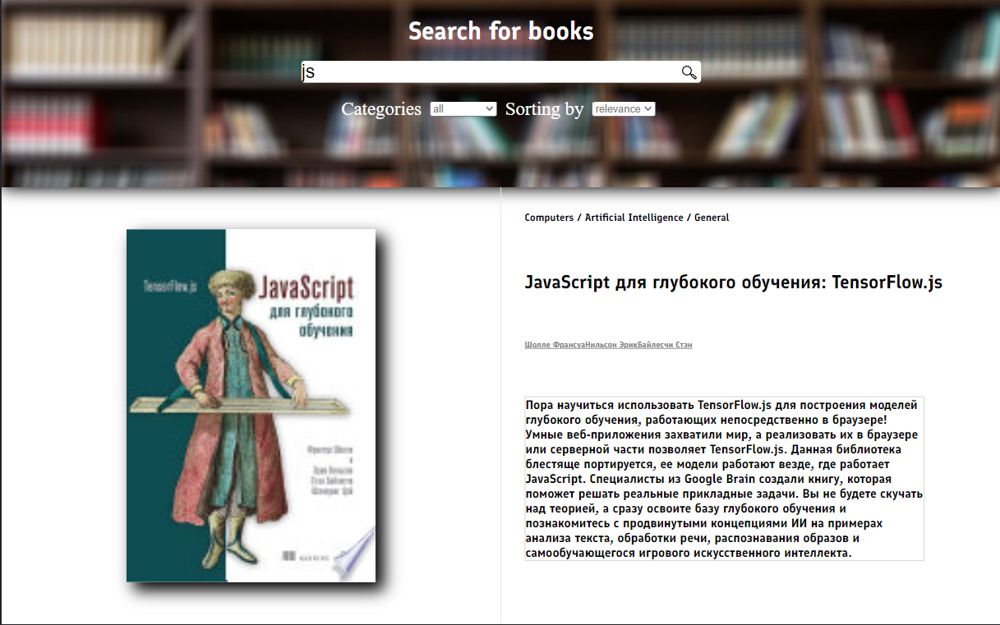
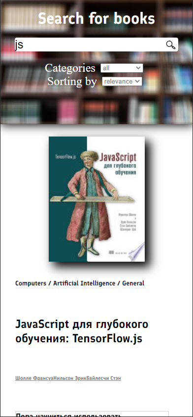

# Book-search

Проект использует Google Books API, для получения информации
о книгах, после чего позволяет посмотреть информацию по каждой из них.

Основан на репозитории [GitHub](https://github.com/fugr-ru/frontend-javascript-test-2)

Проект использует следующий стек технологий:

<ul>
  <li>React</li>
  <li>Redux toolkit</li>
  <li>HTML5/SCSS</li>
  <li>Typescript</li>
  <li>React Router v6</li>
  <li>Axios</li>
  <li>lodash.debounce</li>
  <li>React content loader(Skeletons)</li>
</ul>

Проект создавался с целью обучения технологиям, и использует следующие фичи:

<ul>
  <li>Колбэки</li>
  <li>CSS модули</li>
  <li>Тени</li>
  <li>Хуки useEffect, useState, useRef, useNavigate, useParams</li>
  <li>Управляемые инпуты</li>
  <li>CreateAsyncThunk(Redux toolkit)</li>
  <li>Promise</li>
  <li>Индикация загрузки контента(React content loader + skeletons)</li>
  <li>Адаптиваня вёрстка для экранов от 320 до 1920 пикселей</li>
  <li>Медиа запросы CSS</li>
  <li>CSS гриды</li>
  <li>Использован Outlet для создания Layout</li>
  <li>Работа с документацией Google books API и ключами</li>
  <li>Реализована Пагинация со сложной логикой через собственный компонент Paginate</li>
  <li>Axios Config</li>
  <li>Динамические роуты</li>
</ul>

### Примеры

Можно протестировать на [link]()

Главная страница на ПК

Главная страница на телефоне

Страница книги на ПК

Страница книги на телефоне

